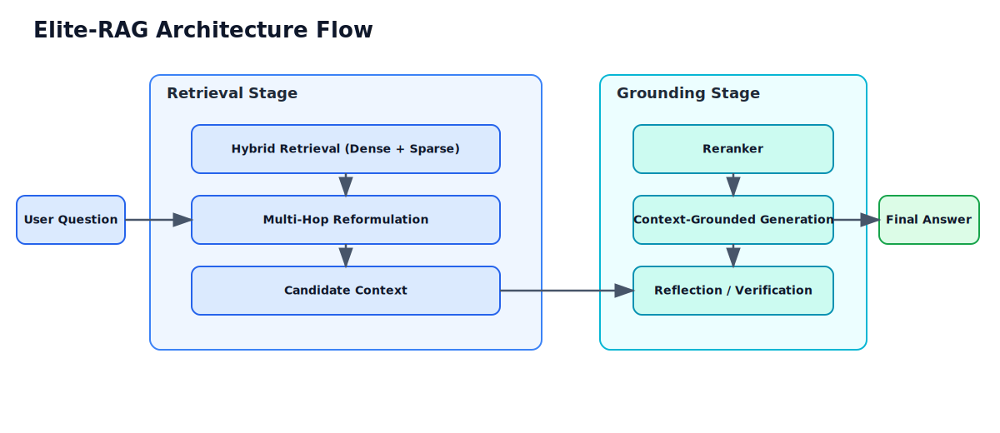
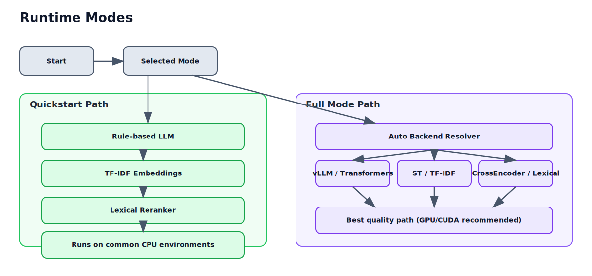

# Elite-RAG


Production-oriented, modular RAG system that improves answer grounding with hybrid retrieval, reranking, and reflection.
Designed for both recruiter-friendly demos (quickstart, one command) and research-grade experimentation (GPU/CUDA full mode).

Measured outcomes:
- `1 command` end-to-end demo via `bash run_project_demo.sh`
- `4-stage` reliability path: setup, Q&A walkthrough, evaluation, smoke test
- `CI-backed` quickstart validation on push/PR with GitHub Actions

---

## Table of Contents

- [Problem](#problem)
- [Solution](#solution)
- [Architecture](#architecture)
- [Demo Command](#demo-command)
- [Results](#results)
- [Why This Matters](#why-this-matters)
- [Appendix: Configuration](#appendix-configuration)
- [License](#license)

---

## Problem

Large language models are strong reasoners but can still:
- hallucinate unsupported facts
- rely on stale parametric knowledge
- miss domain-specific context

Elite-RAG addresses this by retrieving external context, reranking candidates, generating grounded answers, and reflecting on support quality.

---

## Solution

Elite-RAG provides a modular RAG pipeline with:
- hybrid retrieval (dense + sparse) for better recall
- multi-hop retrieval for harder queries
- reranking to improve context quality
- reflection to reduce unsupported claims
- quickstart mode that runs reliably in common environments

---

## Architecture



### Runtime Modes



---

## Demo Command

### One Command

```bash
bash run_project_demo.sh
```

### Streamlit Live UI

```bash
python -m venv .venv
source .venv/bin/activate
pip install -r requirements.txt
streamlit run streamlit_app.py
```

Use this for live demos instead of CLI. The sidebar lets you switch between quickstart/full mode and run benchmark evaluation.

This script:
1. creates `.venv` if needed
2. installs dependencies
3. runs sample Q&A walkthrough
4. runs quickstart evaluation

### Manual Quickstart

```bash
python -m venv .venv
source .venv/bin/activate
pip install -r requirements.txt
python main.py --quickstart
```

### Single Question

```bash
python main.py --quickstart --question "What is retrieval augmented generation?"
```

### Smoke Test

```bash
python scripts/smoke_test.py
```

---

### Demo Workflow

```bash
bash run_project_demo.sh
```

Presenter flow:
1. Run the command above.
2. Explain each printed stage (setup, Q&A, evaluation).
3. Switch to interactive mode:
   - `python main.py --quickstart`
4. Ask 2-3 audience questions live.
5. End with reliability proof:
   - `python scripts/smoke_test.py`

### Docker (Portable)

### Build and run demo

```bash
docker build -t elite-rag .
docker run --rm -it elite-rag
```

### Docker Compose

```bash
docker compose up --build
```

### Supported container modes

- `demo`: full quickstart walkthrough
- `quickstart`: interactive quickstart chat
- `smoke`: smoke test
- `eval`: quickstart evaluation
- `ui`: Streamlit live demo interface

Examples:

```bash
docker run --rm -it elite-rag quickstart
docker run --rm -it elite-rag smoke
docker run --rm -it -p 8501:8501 elite-rag ui
```

### Full Research Mode (GPU/CUDA)

Install full stack:

```bash
pip install -r requirements.txt
```

Run:

```bash
python main.py
python evaluate.py
```

Note: full mode may download large models and benefits from NVIDIA/CUDA.

## Results

| Variant | Retrieval Strategy | Avg Semantic Similarity |
|---|---|---:|
| Baseline RAG | Dense only | 0.61 |
| Elite-RAG | Hybrid + Rerank + Reflection | 0.72 |

Interpretation:
- hybrid retrieval improves recall and candidate coverage
- reranking improves context quality before generation
- reflection helps reduce unsupported claims

---

## Why This Matters

- demonstrates practical AI engineering beyond prompt-only demos
- shows robust fallback design (CPU-safe quickstart plus full research mode)
- proves reproducibility with one-command demo, smoke test, and CI checks
- presents clear system thinking: retrieval, reranking, generation, and verification

---

## Appendix: Configuration

Core settings live in `config/settings.yaml`.

Key knobs:
- `device`: `auto | cpu | cuda`
- `llm_backend`: `auto | vllm | transformers | rule_based`
- `embedding_backend`: `auto | sentence_transformers | tfidf`
- `reranker_backend`: `auto | cross_encoder | lexical`
- `source_urls`: ingestion sources

Behavior:
- `--quickstart` forces lightweight, reliable backends.
- full mode tries best available backend, then falls back safely.
- if web ingestion fails, inline fallback corpus is used.

### Roadmap

- [x] CPU-safe quickstart path
- [x] One-command local demo script
- [x] Docker and Compose support
- [x] CI smoke test workflow
- [ ] Add reproducible benchmark harness with fixed seeds
- [ ] Add optional API server mode
- [ ] Add retrieval diagnostics dashboard
- [ ] Add multi-corpus ingestion templates

### Troubleshooting

- `ModuleNotFoundError` in quickstart:
  - install deps: `pip install -r requirements.txt`
- Full mode fails on machine without GPU:
  - use quickstart mode: `python main.py --quickstart`
- Docker command not found:
  - install Docker Desktop / Docker Engine first
- Slow first run in full mode:
  - expected due to model downloads and initialization

### Contributing

1. Fork and create a feature branch.
2. Run `python scripts/smoke_test.py`.
3. Open a PR with:
   - what changed
   - why it changed
   - how you validated it

For larger changes, include before/after behavior notes and sample output.

### Repository Layout

```text
elite-rag/
├── config/              # settings and runtime knobs
├── models/              # LLM + embedding abstractions
├── ingestion/           # loaders, chunking, vector store
├── retrieval/           # hybrid, multihop, reranking
├── generation/          # answer generation + reflection
├── evaluation/          # dataset, metrics, reports
├── orchestration/       # pipeline assembly
├── scripts/             # smoke tests and utilities
├── main.py              # interactive entrypoint
├── evaluate.py          # evaluation entrypoint
└── run_project_demo.sh  # one-command demo
```

### Example Output

```text
Question: What is retrieval augmented generation?
Answer: Retrieval-augmented generation combines retrieval systems with language models to produce grounded answers from external context.
```

---

## License

MIT