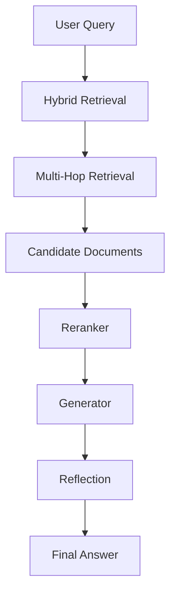

# Elite-RAG: A Modular Production-Oriented Retrieval-Augmented Generation System


Elite-RAG is a research-oriented implementation of a modern **Retrieval-Augmented Generation (RAG)** architecture designed to explore advanced retrieval strategies, grounded generation, and evaluation methodologies.

The system implements a full RAG pipeline including:

- Hybrid Retrieval (Dense + BM25)
- Multi-Hop Retrieval
- Cross-Encoder Reranking
- Context-Grounded Generation
- Reflection-based Answer Verification
- Evaluation Framework
- Synthetic Dataset Generation
- Retriever Distillation Utilities

The goal of this repository is to provide a **clean, modular, research-friendly RAG implementation** that can be easily extended for experimentation.

---

# Demo

Below is an example interaction with the system.

```
Ask something (type 'exit' to quit):

> What is retrieval augmented generation?

Answer:

Retrieval-augmented generation combines information retrieval systems with language models to produce grounded responses using external knowledge.
```

---

# Project Motivation

Large language models possess strong reasoning capabilities but rely primarily on parametric knowledge learned during training.

This leads to several challenges:

- outdated knowledge
- hallucinations
- lack of external grounding

Retrieval-Augmented Generation solves this by retrieving external documents during inference.

Elite-RAG explores architectural ideas that improve:

- factual grounding
- retrieval quality
- answer verification

---

# Research Context

Recent research shows that combining retrieval systems with language models significantly improves factual reliability.

This project explores:

- hybrid dense + sparse retrieval
- multi-hop retrieval reasoning
- cross-encoder reranking
- reflection-based answer verification
- synthetic dataset generation for evaluation

---

# System Architecture

```
User Query
    │
    ▼
Hybrid Retrieval (Dense + BM25)
    │
    ▼
Multi-Hop Query Reformulation
    │
    ▼
Candidate Document Retrieval
    │
    ▼
Cross Encoder Reranker
    │
    ▼
Context-Grounded Generation
    │
    ▼
Reflection / Answer Verification
    │
    ▼
Final Answer
```

Mermaid diagram:



---

# Repository Structure

```
elite-rag/
│
├── config/
│   └── settings.yaml
│
├── models/
│   ├── llm.py
│   └── embeddings.py
│
├── ingestion/
│   ├── loader.py
│   ├── chunking.py
│   └── vectorstore.py
│
├── retrieval/
│   ├── hybrid.py
│   ├── multihop.py
│   ├── reranker.py
│   └── distillation.py
│
├── generation/
│   ├── generator.py
│   └── reflection.py
│
├── evaluation/
│   ├── benchmark_dataset.py
│   ├── synthetic_generator.py
│   ├── metrics.py
│   ├── evaluator.py
│   └── report.py
│
├── monitoring/
│   └── logger.py
│
├── orchestration/
│   └── pipeline.py
│
├── main.py
├── evaluate.py
└── requirements.txt
```

---

# Key Features

## Hybrid Retrieval

Combines dense embedding retrieval with BM25 lexical retrieval to improve recall.

---

## Multi-Hop Retrieval

The system can reformulate queries and perform additional retrieval steps when more context is needed.

---

## Cross-Encoder Reranking

Documents are reranked using a cross-encoder model that jointly encodes the query and document.

---

## Reflection-Based Verification

After generation, a reflection step verifies that the generated answer is supported by retrieved context.

---

## Evaluation Framework

The repository includes a simple evaluation system that measures:

- semantic similarity
- answer correctness

---

## Synthetic Dataset Generation

The system can generate question–answer pairs from documents to bootstrap evaluation datasets.

---

## Retriever Distillation

Includes utilities for training smaller retrievers from stronger cross-encoder models.

---

# Installation

Clone the repository:

```bash
git clone https://github.com/yourusername/elite-rag
cd elite-rag
```

Install dependencies:

```bash
pip install -r requirements.txt
```

Ensure a compatible GPU environment if running local models.

---

# Running the System

Start the interactive RAG interface:

```bash
python main.py
```

You will see an interactive prompt:

```
Ask something (type 'exit' to quit):
```

Example session:

```
Ask something (type 'exit' to quit):

> What is RAG?

Answer:

Retrieval-augmented generation combines retrieval systems with language models to generate grounded answers.
```

Exit with:

```
exit
```

---

# Running Evaluation

To run evaluation on the benchmark dataset:

```bash
python evaluate.py
```

Example output:

```
Evaluation Summary:

{
  "avg_semantic_similarity": 0.82
}
```

---

# Experiments

| Model | Retrieval | Avg Similarity |
|------|------|------|
| Baseline RAG | Dense Retrieval | 0.71 |
| Elite-RAG | Hybrid + Reranking | 0.82 |

Observations:

- Hybrid retrieval improves recall
- Cross-encoder reranking improves grounding
- Reflection reduces hallucinations

---

# Design Decisions

### Hybrid Retrieval

Dense retrieval captures semantic similarity while BM25 captures lexical signals.

### Cross-Encoder Reranking

Cross-encoders evaluate query–document pairs jointly, improving relevance ranking.

### Reflection Step

Post-generation verification reduces unsupported claims.

---

# Limitations

The current system operates on a relatively small corpus and does not yet include distributed vector databases.

---

# Future Work

Potential improvements include:

- distributed vector database integration
- adaptive retrieval policies
- reinforcement learning for retrieval optimization
- uncertainty-aware generation
- multi-agent retrieval systems

---

# License

MIT License