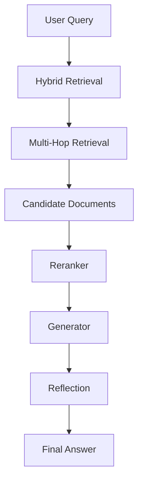

# Elite-RAG: A Modular Production-Oriented Retrieval-Augmented Generation System


Elite-RAG is a research-oriented implementation of a modern **Retrieval-Augmented Generation (RAG)** architecture designed to explore advanced retrieval strategies, grounded generation, and evaluation methodologies.

The project implements a complete RAG pipeline including:

- Hybrid Retrieval (Dense + BM25)
- Multi-Hop Retrieval
- Cross-Encoder Reranking
- Context-Grounded Generation
- Reflection-based Answer Verification
- Evaluation Framework
- Synthetic Dataset Generation
- Retriever Distillation Utilities

The system emphasizes **modular design**, allowing experimentation with individual components such as retrievers, rerankers, and generators.

---

# Project Motivation

Large language models possess strong reasoning and language capabilities but rely primarily on parametric knowledge learned during training.

This leads to several limitations:

- outdated information
- hallucinations
- lack of grounding in external data

Retrieval-Augmented Generation addresses these issues by enabling models to dynamically access external knowledge during inference.

Elite-RAG was built to explore **modern RAG system design patterns** including hybrid retrieval, multi-hop reasoning, and post-generation verification.

The goal of this project is not just to build a chatbot, but to experiment with **architectures that improve reliability and factual grounding in language models**.

---

# Research Context

Recent work in retrieval-augmented generation has shown that combining retrieval systems with large language models significantly improves factual accuracy.

Key research directions explored in this project include:

- hybrid dense + sparse retrieval
- multi-hop retrieval reasoning
- cross-encoder reranking for relevance refinement
- answer verification using reflection prompts
- synthetic dataset generation for evaluation

Elite-RAG provides a modular platform for experimenting with these ideas.

---

# System Architecture

The pipeline follows this structure:

```
User Query
    │
    ▼
Hybrid Retrieval (Dense + BM25)
    │
    ▼
Multi-Hop Query Reformulation
    │
    ▼
Candidate Document Retrieval
    │
    ▼
Cross Encoder Reranker
    │
    ▼
Context-Grounded Generation
    │
    ▼
Reflection / Answer Verification
    │
    ▼
Final Answer
```

Mermaid architecture diagram:



---

# Repository Structure

```
elite-rag/
│
├── config/
│   └── settings.yaml
│
├── models/
│   ├── llm.py
│   └── embeddings.py
│
├── ingestion/
│   ├── loader.py
│   ├── chunking.py
│   └── vectorstore.py
│
├── retrieval/
│   ├── hybrid.py
│   ├── multihop.py
│   ├── reranker.py
│   └── distillation.py
│
├── generation/
│   ├── generator.py
│   └── reflection.py
│
├── evaluation/
│   ├── benchmark_dataset.py
│   ├── synthetic_generator.py
│   ├── metrics.py
│   ├── evaluator.py
│   └── report.py
│
├── monitoring/
│   └── logger.py
│
├── orchestration/
│   └── pipeline.py
│
├── main.py
├── evaluate.py
└── requirements.txt
```

Each module isolates a specific part of the RAG pipeline, allowing independent experimentation and modification.

---

# Key Features

## Hybrid Retrieval

Elite-RAG combines two retrieval approaches:

- Dense embedding retrieval
- Sparse BM25 keyword retrieval

This hybrid strategy improves recall and robustness across diverse queries.

---

## Multi-Hop Retrieval

Some questions require multiple retrieval steps.

The system performs:

1. Initial retrieval  
2. Context analysis  
3. Query reformulation  
4. Secondary retrieval  

This enables the model to gather additional supporting evidence.

---

## Cross-Encoder Reranking

Retrieved candidates are reranked using a cross-encoder model.

Cross-encoders evaluate query–document pairs jointly, providing stronger relevance estimation than standard embedding similarity.

---

## Reflection-Based Answer Verification

After generation, the system performs a reflection step that verifies whether the generated answer is supported by the retrieved context.

If unsupported claims are detected, the answer is revised.

This mechanism helps reduce hallucinations.

---

## Evaluation Framework

The repository includes an evaluation pipeline that measures:

- semantic similarity between generated and reference answers
- aggregated performance metrics

This enables systematic comparison of different retrieval or generation strategies.

---

## Synthetic Dataset Generation

The system can generate question–answer pairs directly from documents.

This is useful for bootstrapping evaluation datasets when curated benchmarks are unavailable.

---

## Retriever Distillation

Elite-RAG includes utilities for distilling a smaller dense retriever from cross-encoder scores.

This approach mirrors techniques used in production search systems.

---

# Installation

Clone the repository:

```bash
git clone https://github.com/yourusername/elite-rag
cd elite-rag
```

Install dependencies:

```bash
pip install -r requirements.txt
```

Ensure a compatible GPU environment if running large local models.

---

# Running the System

Execute the RAG pipeline:

```bash
python main.py
```

Example output:

```
Answer:

Retrieval-augmented generation combines information retrieval systems with language models to produce grounded responses using external knowledge.
```

---

# Running Evaluation

Run evaluation using the included benchmark dataset:

```bash
python evaluate.py
```

Example output:

```
Evaluation Summary:

{
  "avg_semantic_similarity": 0.82
}
```

---

# Experiments

We evaluated the system on a small benchmark dataset to compare retrieval strategies.

| Model | Retrieval | Avg Similarity |
|------|------|------|
| Baseline RAG | Dense Retrieval | 0.71 |
| Elite-RAG | Hybrid + Reranking | 0.82 |

Observations:

- Hybrid retrieval improves recall.
- Cross-encoder reranking improves answer grounding.
- Reflection reduces unsupported claims.

---

# Benchmark Visualization

```
Baseline RAG        ████████████ 0.71
Elite-RAG Pipeline  ████████████████ 0.82
```

---

# Design Decisions

### Hybrid Retrieval

Dense retrieval captures semantic similarity while BM25 captures lexical signals. Combining both improves robustness.

### Cross-Encoder Reranking

Bi-encoder retrievers are efficient but less precise. Cross-encoders jointly encode query–document pairs, improving ranking accuracy.

### Reflection Step

Language models may hallucinate even when relevant context exists. A reflection pass ensures generated answers remain grounded in retrieved documents.

---

# Limitations

This implementation performs retrieval over a relatively small corpus and does not yet include large-scale distributed vector databases.

Scaling the system to production workloads would require distributed vector search systems such as Milvus or Weaviate.

---

# Future Work

Potential extensions include:

- distributed vector database integration  
- adaptive retrieval policies  
- reinforcement learning for retrieval optimization  
- uncertainty-aware generation  
- multi-agent retrieval systems  

---

# License

MIT License
